# Proyecto Final - Migración de MariaDB a PostgreSQL

## Tecnología de Base de Datos I

### Migración de tablas, vistas y verificación de MariaDB a PostgreSQL

**Estudiante:** Jhon Emanuel Flores Chambi  
**Asignatura:** Tecnología de Base de Datos I  
**Docente:** Jared Lopez Leaños  
**Fecha:** 24 Septiembre de 2026  

---

# Índice

- [1. Migración de tablas](#1-migración-de-tablas)
  - [1.1 Objetivo](#11-objetivo)
  - [1.2 Verificación inicial de la estructura de destino](#12-verificación-inicial-de-la-estructura-de-destino)
  - [1.3 Conteo de registros en MariaDB antes de la migración](#13-conteo-de-registros-en-mariadb-antes-de-la-migración)
  - [1.4 Exportación de los datos desde MariaDB](#14-exportación-de-los-datos-desde-mariadb)
  - [1.5 Herramienta utilizada para la migración](#15-herramienta-utilizada-para-la-migración)
  - [1.6 Consideración sobre la estructura de PostgreSQL](#16-consideración-sobre-la-estructura-de-postgresql)
  - [1.7 Configuración de pgloader para migrar únicamente los datos](#17-configuración-de-pgloader-para-migrar-únicamente-los-datos)
  - [1.8 Ejecución de la migración](#18-ejecución-de-la-migración)
  - [1.9 Verificación de los tipos después de la migración](#19-verificación-de-los-tipos-después-de-la-migración)
  - [1.10 Verificación del tipo ENUM](#110-verificación-del-tipo-enum)
  - [1.11 Verificación de claves primarias](#111-verificación-de-claves-primarias)
  - [1.12 Verificación de claves foráneas](#112-verificación-de-claves-foráneas)
  - [1.13 Conteo de registros en PostgreSQL](#113-conteo-de-registros-en-postgresql)
  - [1.14 Comparación MariaDB vs PostgreSQL](#114-comparación-mariadb-vs-postgresql)
  - [1.15 Verificación del log de pgloader](#115-verificación-del-log-de-pgloader)
  - [1.16 Conclusión de la migración de tablas](#116-conclusión-de-la-migración-de-tablas)

- [2. Migración de Vistas](#2-migración-de-vistas)
  - [2.1 Objetivo](#21-objetivo)
  - [2.2 Identificación de las vistas en MariaDB](#22-identificación-de-las-vistas-en-mariadb)
  - [2.3 Extracción de la definición original de `dept_emp_latest_date`](#23-extracción-de-la-definición-original-de-dept_emp_latest_date)
  - [2.4 Extracción de la definición original de `current_dept_emp`](#24-extracción-de-la-definición-original-de-current_dept_emp)
  - [2.5 Verificación inicial de vistas en PostgreSQL](#25-verificación-inicial-de-vistas-en-postgresql)
  - [2.6 Adaptación de sintaxis de MariaDB a PostgreSQL](#26-adaptación-de-sintaxis-de-mariadb-a-postgresql)
  - [2.7 Definición adaptada de `dept_emp_latest_date`](#27-definición-adaptada-de-dept_emp_latest_date)
  - [2.8 Verificación de `dept_emp_latest_date` en PostgreSQL](#28-verificación-de-dept_emp_latest_date-en-postgresql)
  - [2.9 Definición adaptada de `current_dept_emp`](#29-definición-adaptada-de-current_dept_emp)
  - [2.10 Verificación de `current_dept_emp` en PostgreSQL](#210-verificación-de-current_dept_emp-en-postgresql)
  - [2.11 Verificación de las vistas creadas en PostgreSQL](#211-verificación-de-las-vistas-creadas-en-postgresql)
  - [2.12 Prueba de `dept_emp_latest_date` en PostgreSQL](#212-prueba-de-dept_emp_latest_date-en-postgresql)
  - [2.13 Comparación de `dept_emp_latest_date` con MariaDB](#213-comparación-de-dept_emp_latest_date-con-mariadb)
  - [2.14 Prueba de `current_dept_emp` en PostgreSQL](#214-prueba-de-current_dept_emp-en-postgresql)
  - [2.15 Comparación de `current_dept_emp` con MariaDB](#215-comparación-de-current_dept_emp-con-mariadb)
  - [2.16 Conteo total de registros de las vistas en MariaDB](#216-conteo-total-de-registros-de-las-vistas-en-mariadb)
  - [2.17 Conteo total de registros de las vistas en PostgreSQL](#217-conteo-total-de-registros-de-las-vistas-en-postgresql)
  - [2.18 Verificación de las definiciones adaptadas almacenadas en PostgreSQL](#218-verificación-de-las-definiciones-adaptadas-almacenadas-en-postgresql)
  - [2.19 Resultado de la migración de vistas](#219-resultado-de-la-migración-de-vistas)

- [3. Consultas de Verificación](#3-consultas-de-verificación)
  - [3.1 Objetivo de la verificación](#31-objetivo-de-la-verificación)
  - [3.2 Conteo de filas en MariaDB](#32-conteo-de-filas-en-mariadb)
  - [3.3 Conteo de filas en PostgreSQL](#33-conteo-de-filas-en-postgresql)
  - [3.4 Comparación de conteos entre MariaDB y PostgreSQL](#34-comparación-de-conteos-entre-mariadb-y-postgresql)
  - [3.5 Metodología utilizada para los checksums](#35-metodología-utilizada-para-los-checksums)
  - [3.6 Checksum de la tabla `departments`](#36-checksum-de-la-tabla-departments)
  - [3.7 Checksum de la tabla `employees`](#37-checksum-de-la-tabla-employees)
  - [3.8 Checksum de la tabla `dept_emp`](#38-checksum-de-la-tabla-dept_emp)
  - [3.9 Checksum de la tabla `dept_manager`](#39-checksum-de-la-tabla-dept_manager)
  - [3.10 Verificación y corrección del checksum de `salaries`](#310-verificación-y-corrección-del-checksum-de-salaries)
  - [3.11 Checksum de la tabla `titles`](#311-checksum-de-la-tabla-titles)
  - [3.12 Comparación general de checksums](#312-comparación-general-de-checksums)
  - [3.13 Verificación de registros huérfanos en MariaDB](#313-verificación-de-registros-huérfanos-en-mariadb)
  - [3.14 Verificación de registros huérfanos en PostgreSQL](#314-verificación-de-registros-huérfanos-en-postgresql)
  - [3.15 Verificación de claves foráneas en PostgreSQL](#315-verificación-de-claves-foráneas-en-postgresql)
  - [3.16 Análisis comparativo de los resultados](#316-análisis-comparativo-de-los-resultados)
  - [3.17 Resultado final de la verificación](#317-resultado-final-de-la-verificación)

- [4. Respaldo final de PostgreSQL](#4-respaldo-final-de-postgresql)
  - [4.1 Generación del respaldo](#41-generación-del-respaldo)
  - [4.2 Verificación del respaldo](#42-verificación-del-respaldo)
- [Referencias](#referencias)

## 1. Migración de tablas

### 1.1 Objetivo

El objetivo de esta etapa fue migrar los datos de la base de datos `employees` alojada en MariaDB hacia la base de datos `pdb_employees` en PostgreSQL 18.

La estructura de las seis tablas de destino ya había sido creada y adaptada previamente durante la Actividad 5. Por este motivo, para el Proyecto Final se realizó una migración de los datos conservando posteriormente la estructura corregida en PostgreSQL.

Las tablas involucradas fueron:

- `departments`
- `employees`
- `dept_emp`
- `dept_manager`
- `salaries`
- `titles`

---

### 1.2 Verificación inicial de la estructura de destino

Antes de realizar la migración definitiva se verificó que las seis tablas existieran dentro del esquema `employees` de la base de datos `pdb_employees`.

```bash
psql -h localhost -U jhon -d pdb_employees -c '\dt employees.*'
```

Salida:

```text
            Listado de tablas
  Esquema  |    Nombre    | Tipo  | Dueño
-----------+--------------+-------+-------
 employees | departments  | tabla | jhon
 employees | dept_emp     | tabla | jhon
 employees | dept_manager | tabla | jhon
 employees | employees    | tabla | jhon
 employees | salaries     | tabla | jhon
 employees | titles       | tabla | jhon
(6 filas)
```

También se comprobó inicialmente que las tablas se encontraban vacías:

```bash
psql -h localhost -U jhon -d pdb_employees -c "SELECT 'departments' AS tabla, COUNT(*) FROM employees.departments UNION ALL SELECT 'employees', COUNT(*) FROM employees.employees UNION ALL SELECT 'dept_emp', COUNT(*) FROM employees.dept_emp UNION ALL SELECT 'dept_manager', COUNT(*) FROM employees.dept_manager UNION ALL SELECT 'salaries', COUNT(*) FROM employees.salaries UNION ALL SELECT 'titles', COUNT(*) FROM employees.titles;"
```

Salida:

```text
    tabla     | count
--------------+-------
 departments  |     0
 employees    |     0
 dept_emp     |     0
 dept_manager |     0
 salaries     |     0
 titles       |     0
(6 filas)
```

Esto confirmó que la estructura estaba preparada para recibir los datos.

---

### 1.3 Conteo de registros en MariaDB antes de la migración

Antes de cargar los datos se obtuvo la cantidad de registros existentes en cada tabla de la base de datos origen.

```bash
mariadb -h 127.0.0.1 -u root -p employees -e "SELECT 'departments' AS tabla, COUNT(*) AS registros FROM departments UNION ALL SELECT 'employees', COUNT(*) FROM employees UNION ALL SELECT 'dept_emp', COUNT(*) FROM dept_emp UNION ALL SELECT 'dept_manager', COUNT(*) FROM dept_manager UNION ALL SELECT 'salaries', COUNT(*) FROM salaries UNION ALL SELECT 'titles', COUNT(*) FROM titles;"
```

Resultado:

```text
+--------------+-----------+
| tabla        | registros |
+--------------+-----------+
| departments  |         9 |
| employees    |    300024 |
| dept_emp     |    331603 |
| dept_manager |        24 |
| salaries     |   2844047 |
| titles       |    443308 |
+--------------+-----------+
```

En total, la base de datos origen contiene **3.919.015 registros** distribuidos entre las seis tablas.

Como evidencia visual complementaria se registró el resultado del conteo en MariaDB:

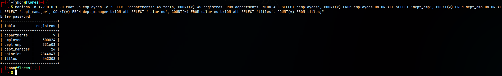

---

### 1.4 Exportación de los datos desde MariaDB

Como parte del proceso de migración se realizó una exportación de los datos de las seis tablas de la base de datos `employees` en MariaDB.

Para generar un archivo que contuviera únicamente los datos, sin volver a exportar la estructura de las tablas ni los triggers, se utilizó `mariadb-dump` con las opciones `--no-create-info` y `--skip-triggers`.

Primero se verificó la disponibilidad de la herramienta:

```bash
mariadb-dump --version
```

Salida:

```text
mariadb-dump  Ver 10.19 Distrib 10.11.18-MariaDB, for debian-linux-gnu (x86_64)
```

La exportación de los datos se realizó mediante:

```bash
mkdir -p ~/ProyectoFinal_JhonFlores/archivos && mariadb-dump -h 127.0.0.1 -u root -p --no-create-info --skip-triggers employees departments employees dept_emp dept_manager salaries titles > ~/ProyectoFinal_JhonFlores/archivos/employees_datos.sql
```

El archivo generado fue:

```text
~/ProyectoFinal_JhonFlores/archivos/employees_datos.sql
```

Posteriormente se verificó su existencia y tamaño:

```bash
ls -lh ~/ProyectoFinal_JhonFlores/archivos/employees_datos.sql
```

Salida:

```text
-rw-r--r-- 1 jhon jhon 165M sep 24 18:11 /home/jhon/ProyectoFinal_JhonFlores/archivos/employees_datos.sql
```

El archivo de exportación tiene un tamaño de **165 MB**.

Para comprobar que el dump contenía datos correspondientes a las seis tablas requeridas se ejecutó:

```bash
grep -oE 'INSERT INTO `(departments|employees|dept_emp|dept_manager|salaries|titles)`' ~/ProyectoFinal_JhonFlores/archivos/employees_datos.sql | sort -u
```

Resultado:

```text
INSERT INTO `departments`
INSERT INTO `dept_emp`
INSERT INTO `dept_manager`
INSERT INTO `employees`
INSERT INTO `salaries`
INSERT INTO `titles`
```

El resultado confirma la presencia de las seis tablas dentro de la exportación.

Finalmente se verificó la terminación correcta del archivo:

```bash
tail -5 ~/ProyectoFinal_JhonFlores/archivos/employees_datos.sql
```

Resultado:

```text
/*!40101 SET CHARACTER_SET_RESULTS=@OLD_CHARACTER_SET_RESULTS */;
/*!40101 SET COLLATION_CONNECTION=@OLD_COLLATION_CONNECTION */;
/*!40111 SET SQL_NOTES=@OLD_SQL_NOTES */;

-- Dump completed on 2026-09-24 18:11:11
```

La línea `Dump completed` confirma que `mariadb-dump` finalizó correctamente la generación del archivo.

Por lo tanto, se obtuvo una exportación de los datos correspondientes a las seis tablas de MariaDB.

---

### 1.5 Herramienta utilizada para la migración

Para realizar la migración hacia PostgreSQL se utilizó **pgloader**.

La versión instalada se verificó mediante:

```bash
pgloader --version
```

Salida:

```text
pgloader version "3.6.10~devel"
compiled with SBCL 2.2.9.debian
```

La herramienta permite conectar directamente MariaDB con PostgreSQL y realizar la transferencia masiva de registros.

---

### 1.6 Consideración sobre la estructura de PostgreSQL

Durante las pruebas se observó que una migración automática completa con pgloader podía generar nuevamente las tablas utilizando conversiones de tipos diferentes a las definidas durante la Actividad 5.

Entre las diferencias detectadas se encontraban conversiones de columnas `emp_no` y `salary` hacia `bigint`, además de la creación automática de un tipo ENUM diferente para la columna `gender`.

Por este motivo se conservó como estructura definitiva la estructura adaptada en la Actividad 5, donde:

- `emp_no` utiliza `integer`.
- `salary` utiliza `integer`.
- `gender` utiliza el tipo ENUM nativo `employees.gender_enum`.

La estructura fue restaurada utilizando el script previamente generado:

```bash
psql -h localhost -U jhon -d pdb_employees -f ~/Actividad5_JhonFlores/archivos/pdb_employees_estructura.sql
```

Salida:

```text
SET
CREATE SCHEMA
ALTER SCHEMA
SET
CREATE TYPE
ALTER TYPE
CREATE TABLE
ALTER TABLE
CREATE INDEX
CREATE TABLE
ALTER TABLE
CREATE TABLE
ALTER TABLE
CREATE INDEX
CREATE TABLE
ALTER TABLE
CREATE INDEX
CREATE TABLE
ALTER TABLE
CREATE TABLE
ALTER TABLE
ALTER TABLE
ALTER TABLE
ALTER TABLE
ALTER TABLE
ALTER TABLE
ALTER TABLE
```

Posteriormente se verificaron los tipos relevantes:

```bash
psql -h localhost -U jhon -d pdb_employees -c "SELECT table_name, column_name, data_type, udt_name FROM information_schema.columns WHERE table_schema='employees' AND (column_name='emp_no' OR column_name='salary' OR column_name='gender') ORDER BY table_name, ordinal_position;"
```

Resultado:

```text
  table_name  | column_name |  data_type   |  udt_name
--------------+-------------+--------------+-------------
 dept_emp     | emp_no      | integer      | int4
 dept_manager | emp_no      | integer      | int4
 employees    | emp_no      | integer      | int4
 employees    | gender      | USER-DEFINED | gender_enum
 salaries     | emp_no      | integer      | int4
 salaries     | salary      | integer      | int4
 titles       | emp_no      | integer      | int4
(7 filas)
```

De esta manera se confirmó que la estructura corregida estaba lista antes de efectuar la carga definitiva.

---

### 1.7 Configuración de pgloader para migrar únicamente los datos

Para evitar que pgloader volviera a crear las tablas y modificara los tipos definidos previamente, se creó el archivo:

```text
~/ProyectoFinal_JhonFlores/migracion_datos.load
```

Su configuración fue:

```text
LOAD DATABASE
    FROM mysql://root:<PASSWORD_MARIADB>@localhost:3306/employees
    INTO postgresql://jhon:<PASSWORD_POSTGRESQL>@localhost:5432/pdb_employees

WITH data only,
     workers = 4,
     concurrency = 1,
     batch rows = 10000

SET maintenance_work_mem to '256MB',
    work_mem to '32MB'

CAST type enum to text
;
```

La opción:

```text
WITH data only
```

permitió utilizar las tablas ya existentes en PostgreSQL en lugar de recrearlas.

Esto fue importante para conservar las adaptaciones realizadas previamente en la estructura.

---

### 1.8 Ejecución de la migración

La migración definitiva se ejecutó mediante:

```bash
pgloader ~/ProyectoFinal_JhonFlores/migracion_datos.load
```

Durante el proceso pgloader detectó diferencias entre los tipos que normalmente utilizaría para la fuente y los tipos existentes en PostgreSQL. Entre los avisos mostrados estuvieron las conversiones de `bigint` hacia columnas destino `integer` y de `text` hacia `gender_enum`.

Estos avisos no impidieron la carga, ya que las columnas de destino conservaron posteriormente sus tipos previamente definidos.

El resumen final de pgloader fue:

```text
             table name     errors       rows      bytes      total time
-----------------------  ---------  ---------  ---------  --------------
        fetch meta data          0         12                     0.068s
      Drop Foreign Keys          0         12                     0.020s
-----------------------  ---------  ---------  ---------  --------------
       employees.titles          0     443308    16.9 MB          2.163s
     employees.salaries          0    2844047    94.2 MB          9.543s
    employees.employees          0     300024    13.2 MB          1.867s
  employees.departments          0          9     0.1 kB          0.256s
     employees.dept_emp          0     331603    10.7 MB          1.091s
 employees.dept_manager          0         24     0.8 kB          0.028s
-----------------------  ---------  ---------  ---------  --------------
COPY Threads Completion          0          4                    10.387s
        Reset Sequences          0          0                     0.068s
    Create Foreign Keys          0          6                     0.720s
       Install Comments          0          0                     0.000s
-----------------------  ---------  ---------  ---------  --------------
      Total import time          ✓    3919015   134.9 MB         11.174s
```

La migración procesó correctamente:

- **3.919.015 registros**
- **134.9 MB de datos**
- **0 errores reportados**

---

### 1.9 Verificación de los tipos después de la migración

Después de cargar los datos se volvió a consultar la estructura para comprobar que pgloader no hubiera modificado los tipos existentes.

```bash
psql -h localhost -U jhon -d pdb_employees -c "SELECT table_name, column_name, data_type, udt_name FROM information_schema.columns WHERE table_schema='employees' AND (column_name='emp_no' OR column_name='salary' OR column_name='gender') ORDER BY table_name, ordinal_position;"
```

Resultado:

```text
  table_name  | column_name |  data_type   |  udt_name
--------------+-------------+--------------+-------------
 dept_emp     | emp_no      | integer      | int4
 dept_manager | emp_no      | integer      | int4
 employees    | emp_no      | integer      | int4
 employees    | gender      | USER-DEFINED | gender_enum
 salaries     | emp_no      | integer      | int4
 salaries     | salary      | integer      | int4
 titles       | emp_no      | integer      | int4
(7 filas)
```

Por lo tanto, la migración de datos no modificó las adaptaciones realizadas en la estructura definitiva.

---

### 1.10 Verificación del tipo ENUM

También se verificaron los valores definidos en el ENUM utilizado por la columna `gender`.

```bash
psql -h localhost -U jhon -d pdb_employees -c "SELECT t.typname AS tipo_enum, e.enumlabel AS valor FROM pg_type t JOIN pg_enum e ON t.oid=e.enumtypid JOIN pg_namespace n ON n.oid=t.typnamespace WHERE n.nspname='employees' AND t.typname='gender_enum' ORDER BY e.enumsortorder;"
```

Resultado:

```text
  tipo_enum  | valor
-------------+-------
 gender_enum | M
 gender_enum | F
(2 filas)
```

Esto confirma que `gender` utiliza un tipo ENUM nativo de PostgreSQL con los valores permitidos `M` y `F`.

---

### 1.11 Verificación de claves primarias

Se verificaron las claves primarias existentes después de la migración:

```bash
psql -h localhost -U jhon -d pdb_employees -c "SELECT conrelid::regclass AS tabla, conname AS restriccion, pg_get_constraintdef(oid) AS definicion FROM pg_constraint WHERE contype='p' AND connamespace='employees'::regnamespace ORDER BY conrelid::regclass::text;"
```

Resultado:

```text
    tabla     |    restriccion    |               definicion
--------------+-------------------+----------------------------------------
 departments  | idx_16391_primary | PRIMARY KEY (dept_no)
 dept_emp     | idx_16396_primary | PRIMARY KEY (emp_no, dept_no)
 dept_manager | idx_16403_primary | PRIMARY KEY (emp_no, dept_no)
 employees    | idx_16410_primary | PRIMARY KEY (emp_no)
 salaries     | idx_16421_primary | PRIMARY KEY (emp_no, from_date)
 titles       | idx_16428_primary | PRIMARY KEY (emp_no, title, from_date)
(6 filas)
```

Se verificaron correctamente las **6 claves primarias**.

---

### 1.12 Verificación de claves foráneas

También se verificaron las relaciones mediante claves foráneas:

```bash
psql -h localhost -U jhon -d pdb_employees -c "SELECT conname AS restriccion, conrelid::regclass AS tabla, pg_get_constraintdef(oid) AS definicion FROM pg_constraint WHERE contype='f' AND connamespace='employees'::regnamespace ORDER BY conrelid::regclass::text, conname;"
```

Resultado:

```text
     restriccion     |    tabla     |                                         definicion
---------------------+--------------+--------------------------------------------------------------------------------------------
 dept_emp_ibfk_1     | dept_emp     | FOREIGN KEY (emp_no) REFERENCES employees(emp_no) ON UPDATE RESTRICT ON DELETE CASCADE
 dept_emp_ibfk_2     | dept_emp     | FOREIGN KEY (dept_no) REFERENCES departments(dept_no) ON UPDATE RESTRICT ON DELETE CASCADE
 dept_manager_ibfk_1 | dept_manager | FOREIGN KEY (emp_no) REFERENCES employees(emp_no) ON UPDATE RESTRICT ON DELETE CASCADE
 dept_manager_ibfk_2 | dept_manager | FOREIGN KEY (dept_no) REFERENCES departments(dept_no) ON UPDATE RESTRICT ON DELETE CASCADE
 salaries_ibfk_1     | salaries     | FOREIGN KEY (emp_no) REFERENCES employees(emp_no) ON UPDATE RESTRICT ON DELETE CASCADE
 titles_ibfk_1       | titles       | FOREIGN KEY (emp_no) REFERENCES employees(emp_no) ON UPDATE RESTRICT ON DELETE CASCADE
(6 filas)
```

Las **6 claves foráneas** quedaron correctamente definidas después de la migración.

---

### 1.13 Conteo de registros en PostgreSQL

Después de finalizar la carga se verificó la cantidad de registros existentes en PostgreSQL:

```bash
psql -h localhost -U jhon -d pdb_employees -c "SELECT 'departments' AS tabla, COUNT(*) AS registros FROM employees.departments UNION ALL SELECT 'employees', COUNT(*) FROM employees.employees UNION ALL SELECT 'dept_emp', COUNT(*) FROM employees.dept_emp UNION ALL SELECT 'dept_manager', COUNT(*) FROM employees.dept_manager UNION ALL SELECT 'salaries', COUNT(*) FROM employees.salaries UNION ALL SELECT 'titles', COUNT(*) FROM employees.titles;"
```

Resultado:

```text
    tabla     | registros
--------------+-----------
 departments  |         9
 employees    |    300024
 dept_emp     |    331603
 dept_manager |        24
 salaries     |   2844047
 titles       |    443308
(6 filas)
```

Como evidencia visual complementaria se registró el conteo obtenido en PostgreSQL:

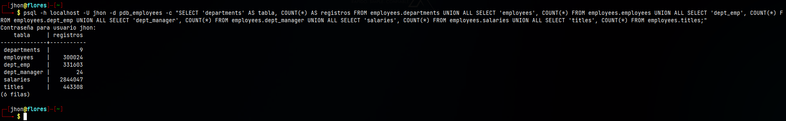

---

### 1.14 Comparación MariaDB vs PostgreSQL

Los resultados obtenidos en ambos gestores fueron:

| Tabla | MariaDB | PostgreSQL | Diferencia | Estado |
|---|---:|---:|---:|---|
| `departments` | 9 | 9 | 0 | Correcto |
| `employees` | 300024 | 300024 | 0 | Correcto |
| `dept_emp` | 331603 | 331603 | 0 | Correcto |
| `dept_manager` | 24 | 24 | 0 | Correcto |
| `salaries` | 2844047 | 2844047 | 0 | Correcto |
| `titles` | 443308 | 443308 | 0 | Correcto |
| **Total** | **3919015** | **3919015** | **0** | **Correcto** |

Los conteos coinciden exactamente entre MariaDB y PostgreSQL.

No se detectó pérdida ni duplicación de registros durante la migración.

---

### 1.15 Verificación del log de pgloader

Finalmente se comprobó si el archivo de log contenía errores críticos:

```bash
grep -nE 'ERROR|FATAL' /tmp/pgloader/pgloader.log
```

El comando no produjo ninguna salida, lo cual indica que no se encontraron entradas con las palabras `ERROR` o `FATAL` en el log consultado.

Esto coincide con el resumen generado por pgloader, que registró `0` errores durante la carga de las seis tablas.

---

### 1.16 Conclusión de la migración de tablas

La migración de datos desde MariaDB hacia PostgreSQL fue completada correctamente.

Como parte del procedimiento se generó previamente una exportación de los datos de las seis tablas mediante `mariadb-dump`. El archivo `employees_datos.sql` obtenido tiene un tamaño de **165 MB** y su finalización fue verificada mediante la marca `Dump completed`.

Posteriormente, los datos fueron transferidos hacia la estructura adaptada de `pdb_employees` utilizando pgloader en modalidad `data only`.

Se transfirieron **3.919.015 registros**, correspondientes a las seis tablas de la base `employees`, hacia la base `pdb_employees`.

La comparación de conteos entre origen y destino presentó una diferencia de **0 registros en todas las tablas**.

Además, se verificó que la estructura adaptada para PostgreSQL se mantuviera después de la carga, conservando:

- columnas `emp_no` de tipo `integer`;
- columna `salary` de tipo `integer`;
- tipo ENUM nativo `gender_enum` con valores `M` y `F`;
- 6 claves primarias;
- 6 claves foráneas.

El resumen de pgloader registró **0 errores**, y la búsqueda de entradas `ERROR` o `FATAL` en el log no produjo resultados.

Por lo tanto, la exportación, migración y validación de las tablas queda completada antes de continuar con la migración y prueba de las vistas.


# 2. Migración de Vistas

## 2.1 Objetivo

El objetivo de este punto fue migrar las vistas existentes en la base de datos `employees` de MariaDB hacia la base de datos `pdb_employees` en PostgreSQL.

El proceso realizado consistió en:

- Identificar las vistas existentes en MariaDB.
- Extraer sus definiciones originales.
- Analizar y adaptar la sintaxis de MariaDB a PostgreSQL.
- Crear las vistas en PostgreSQL respetando sus dependencias.
- Verificar las definiciones creadas.
- Ejecutar consultas de prueba en ambos gestores.
- Comparar los resultados obtenidos entre MariaDB y PostgreSQL.
- Comparar la cantidad total de registros generados por cada vista.

---

## 2.2 Identificación de las vistas en MariaDB

Primero se consultaron las vistas existentes en la base de datos `employees` de MariaDB.

### Comando ejecutado

```bash
mariadb -h 127.0.0.1 -u root -p employees -e "SHOW FULL TABLES WHERE Table_type = 'VIEW';"
```

### Resultado

```text
+----------------------+------------+
| Tables_in_employees  | Table_type |
+----------------------+------------+
| current_dept_emp     | VIEW       |
| dept_emp_latest_date | VIEW       |
+----------------------+------------+
```

Se identificaron un total de **2 vistas**:

- `current_dept_emp`
- `dept_emp_latest_date`

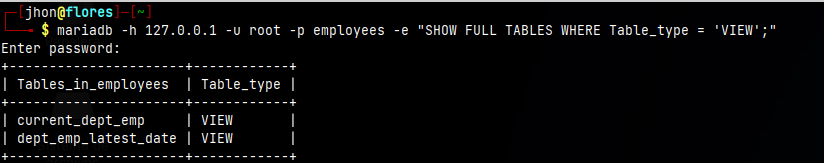

**Figura 3.** Identificación de las vistas originales existentes en MariaDB.

---

## 2.3 Extracción de la definición original de `dept_emp_latest_date`

Para obtener la definición original se utilizó `SHOW CREATE VIEW`.

### Comando ejecutado

```bash
mariadb -h 127.0.0.1 -u root -p employees -e "SHOW CREATE VIEW dept_emp_latest_date\G"
```

### Resultado

```text
View: dept_emp_latest_date
Create View: CREATE ALGORITHM=UNDEFINED DEFINER=`root`@`%` SQL SECURITY DEFINER VIEW `dept_emp_latest_date` AS select `dept_emp`.`emp_no` AS `emp_no`,max(`dept_emp`.`from_date`) AS `from_date`,max(`dept_emp`.`to_date`) AS `to_date` from `dept_emp` group by `dept_emp`.`emp_no`
character_set_client: utf8mb3
collation_connection: utf8mb3_uca1400_ai_ci
```

Esta vista agrupa los registros de `dept_emp` por empleado y obtiene la fecha máxima de inicio (`from_date`) y la fecha máxima de finalización (`to_date`).

---

## 2.4 Extracción de la definición original de `current_dept_emp`

También se obtuvo la definición original de la segunda vista.

### Comando ejecutado

```bash
mariadb -h 127.0.0.1 -u root -p employees -e "SHOW CREATE VIEW current_dept_emp\G"
```

### Resultado

```text
View: current_dept_emp
Create View: CREATE ALGORITHM=UNDEFINED DEFINER=`root`@`%` SQL SECURITY DEFINER VIEW `current_dept_emp` AS select `l`.`emp_no` AS `emp_no`,`d`.`dept_no` AS `dept_no`,`l`.`from_date` AS `from_date`,`l`.`to_date` AS `to_date` from (`dept_emp` `d` join `dept_emp_latest_date` `l` on(`d`.`emp_no` = `l`.`emp_no` and `d`.`from_date` = `l`.`from_date` and `l`.`to_date` = `d`.`to_date`))
character_set_client: utf8mb3
collation_connection: utf8mb3_uca1400_ai_ci
```

La vista `current_dept_emp` depende de `dept_emp_latest_date`, debido a que realiza un `JOIN` entre dicha vista y la tabla `dept_emp`.

Por este motivo, durante la migración fue necesario crear primero:

```text
dept_emp_latest_date
```

y posteriormente:

```text
current_dept_emp
```

---

## 2.5 Verificación inicial de vistas en PostgreSQL

Antes de crear las vistas se verificó si existían vistas dentro del esquema `employees` de PostgreSQL.

### Comando ejecutado

```bash
psql -h localhost -U jhon -d pdb_employees -c "\dv employees.*"
```

### Resultado

```text
No se encontraron vistas con el nombre «employees.*».
```

Esto confirmó que las vistas de MariaDB todavía no se encontraban creadas en PostgreSQL, por lo que fue necesario realizar su migración.

---

## 2.6 Adaptación de sintaxis de MariaDB a PostgreSQL

Las definiciones originales contenían elementos específicos de MariaDB que no debían utilizarse directamente en PostgreSQL.

Se realizaron las siguientes adaptaciones:

| Elemento en MariaDB | Adaptación en PostgreSQL |
|---|---|
| `ALGORITHM=UNDEFINED` | Eliminado |
| `DEFINER=root@%` | Eliminado |
| `SQL SECURITY DEFINER` | Eliminado |
| Backticks `` ` `` | Eliminados |
| `character_set_client` | No requerido |
| `collation_connection` | No requerido |
| Nombres sin esquema | Se utilizó el esquema `employees` en los comandos de creación |
| `MAX()` | Compatible, se mantuvo |
| `GROUP BY` | Compatible, se mantuvo |
| `JOIN` | Compatible, se mantuvo |

No fue necesario modificar la lógica funcional de las consultas. Las principales modificaciones correspondieron a metadatos y sintaxis específica de MariaDB.

---

## 2.7 Definición adaptada de `dept_emp_latest_date`

La definición adaptada para PostgreSQL fue:

```sql
CREATE VIEW employees.dept_emp_latest_date AS
SELECT
    emp_no,
    MAX(from_date) AS from_date,
    MAX(to_date) AS to_date
FROM employees.dept_emp
GROUP BY emp_no;
```

Esta vista debía crearse primero debido a que `current_dept_emp` depende de ella.

### Comando ejecutado

```bash
psql -h localhost -U jhon -d pdb_employees -c "CREATE VIEW employees.dept_emp_latest_date AS SELECT emp_no, MAX(from_date) AS from_date, MAX(to_date) AS to_date FROM employees.dept_emp GROUP BY emp_no;"
```

### Resultado

```text
CREATE VIEW
```

---

## 2.8 Verificación de `dept_emp_latest_date` en PostgreSQL

Después de crear la vista se verificó su estructura y definición.

### Comando ejecutado

```bash
psql -h localhost -U jhon -d pdb_employees -c "\d+ employees.dept_emp_latest_date"
```

### Resultado

```text
Vista «employees.dept_emp_latest_date»

 emp_no    | integer
 from_date | date
 to_date   | date

Definición de vista:
 SELECT emp_no,
    max(from_date) AS from_date,
    max(to_date) AS to_date
   FROM dept_emp
  GROUP BY emp_no;
```

La vista fue creada correctamente y sus columnas mantienen los tipos esperados:

- `emp_no`: `integer`
- `from_date`: `date`
- `to_date`: `date`

---

## 2.9 Definición adaptada de `current_dept_emp`

Después de crear su dependencia, se adaptó la segunda vista.

```sql
CREATE VIEW employees.current_dept_emp AS
SELECT
    l.emp_no,
    d.dept_no,
    l.from_date,
    l.to_date
FROM employees.dept_emp AS d
JOIN employees.dept_emp_latest_date AS l
    ON d.emp_no = l.emp_no
    AND d.from_date = l.from_date
    AND l.to_date = d.to_date;
```

### Comando ejecutado

```bash
psql -h localhost -U jhon -d pdb_employees -c "CREATE VIEW employees.current_dept_emp AS SELECT l.emp_no, d.dept_no, l.from_date, l.to_date FROM employees.dept_emp AS d JOIN employees.dept_emp_latest_date AS l ON d.emp_no = l.emp_no AND d.from_date = l.from_date AND l.to_date = d.to_date;"
```

### Resultado

```text
CREATE VIEW
```

---

## 2.10 Verificación de `current_dept_emp` en PostgreSQL

Se verificó la estructura y definición de la segunda vista.

### Comando ejecutado

```bash
psql -h localhost -U jhon -d pdb_employees -c "\d+ employees.current_dept_emp"
```

### Resultado

```text
Vista «employees.current_dept_emp»

 emp_no    | integer
 dept_no   | character(4)
 from_date | date
 to_date   | date

Definición de vista:
 SELECT l.emp_no,
    d.dept_no,
    l.from_date,
    l.to_date
   FROM dept_emp d
     JOIN dept_emp_latest_date l ON d.emp_no = l.emp_no AND d.from_date = l.from_date AND l.to_date = d.to_date;
```

La vista fue creada correctamente y contiene las columnas esperadas:

- `emp_no`: `integer`
- `dept_no`: `character(4)`
- `from_date`: `date`
- `to_date`: `date`

---

## 2.11 Verificación de las vistas creadas en PostgreSQL

Una vez creadas ambas vistas se consultó el catálogo de vistas del esquema `employees`.

### Comando ejecutado

```bash
psql -h localhost -U jhon -d pdb_employees -c "\dv employees.*"
```

### Resultado

```text
                Listado de vistas
  Esquema  |        Nombre        | Tipo  | Dueño
-----------+----------------------+-------+-------
 employees | current_dept_emp     | vista | jhon
 employees | dept_emp_latest_date | vista | jhon
(2 filas)
```

Por lo tanto, PostgreSQL contiene las mismas dos vistas identificadas originalmente en MariaDB.

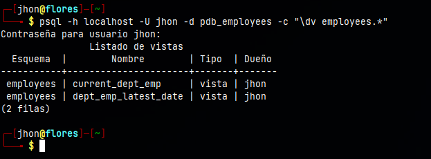

**Figura 4.** Vistas migradas y creadas en el esquema `employees` de PostgreSQL.

---

## 2.12 Prueba de `dept_emp_latest_date` en PostgreSQL

Se ejecutó una consulta sobre los primeros 10 registros de la vista migrada.

### Comando ejecutado

```bash
psql -h localhost -U jhon -d pdb_employees -c "SELECT * FROM employees.dept_emp_latest_date ORDER BY emp_no LIMIT 10;"
```

### Resultado

```text
 emp_no | from_date  |  to_date
--------+------------+------------
  10001 | 1986-06-26 | 9999-01-01
  10002 | 1996-08-03 | 9999-01-01
  10003 | 1995-12-03 | 9999-01-01
  10004 | 1986-12-01 | 9999-01-01
  10005 | 1989-09-12 | 9999-01-01
  10006 | 1990-08-05 | 9999-01-01
  10007 | 1989-02-10 | 9999-01-01
  10008 | 1998-03-11 | 2000-07-31
  10009 | 1985-02-18 | 9999-01-01
  10010 | 2000-06-26 | 9999-01-01
(10 filas)
```

---

## 2.13 Comparación de `dept_emp_latest_date` con MariaDB

Para verificar que la vista migrada mantuviera el mismo resultado, se ejecutó la consulta equivalente en MariaDB.

### Comando ejecutado

```bash
mariadb -h 127.0.0.1 -u root -p employees -e "SELECT * FROM dept_emp_latest_date ORDER BY emp_no LIMIT 10;"
```

### Resultado

```text
+--------+------------+------------+
| emp_no | from_date  | to_date    |
+--------+------------+------------+
|  10001 | 1986-06-26 | 9999-01-01 |
|  10002 | 1996-08-03 | 9999-01-01 |
|  10003 | 1995-12-03 | 9999-01-01 |
|  10004 | 1986-12-01 | 9999-01-01 |
|  10005 | 1989-09-12 | 9999-01-01 |
|  10006 | 1990-08-05 | 9999-01-01 |
|  10007 | 1989-02-10 | 9999-01-01 |
|  10008 | 1998-03-11 | 2000-07-31 |
|  10009 | 1985-02-18 | 9999-01-01 |
|  10010 | 2000-06-26 | 9999-01-01 |
+--------+------------+------------+
```

Los 10 registros obtenidos en MariaDB coinciden con los obtenidos en PostgreSQL.

---

## 2.14 Prueba de `current_dept_emp` en PostgreSQL

Se ejecutó una consulta de prueba sobre los primeros 10 registros de la segunda vista migrada.

### Comando ejecutado

```bash
psql -h localhost -U jhon -d pdb_employees -c "SELECT * FROM employees.current_dept_emp ORDER BY emp_no LIMIT 10;"
```

### Resultado

```text
 emp_no | dept_no | from_date  |  to_date
--------+---------+------------+------------
  10001 | d005    | 1986-06-26 | 9999-01-01
  10002 | d007    | 1996-08-03 | 9999-01-01
  10003 | d004    | 1995-12-03 | 9999-01-01
  10004 | d004    | 1986-12-01 | 9999-01-01
  10005 | d003    | 1989-09-12 | 9999-01-01
  10006 | d005    | 1990-08-05 | 9999-01-01
  10007 | d008    | 1989-02-10 | 9999-01-01
  10008 | d005    | 1998-03-11 | 2000-07-31
  10009 | d006    | 1985-02-18 | 9999-01-01
  10010 | d006    | 2000-06-26 | 9999-01-01
(10 filas)
```

---

## 2.15 Comparación de `current_dept_emp` con MariaDB

Se ejecutó la misma consulta sobre la vista original de MariaDB.

### Comando ejecutado

```bash
mariadb -h 127.0.0.1 -u root -p employees -e "SELECT * FROM current_dept_emp ORDER BY emp_no LIMIT 10;"
```

### Resultado

```text
+--------+---------+------------+------------+
| emp_no | dept_no | from_date  | to_date    |
+--------+---------+------------+------------+
|  10001 | d005    | 1986-06-26 | 9999-01-01 |
|  10002 | d007    | 1996-08-03 | 9999-01-01 |
|  10003 | d004    | 1995-12-03 | 9999-01-01 |
|  10004 | d004    | 1986-12-01 | 9999-01-01 |
|  10005 | d003    | 1989-09-12 | 9999-01-01 |
|  10006 | d005    | 1990-08-05 | 9999-01-01 |
|  10007 | d008    | 1989-02-10 | 9999-01-01 |
|  10008 | d005    | 1998-03-11 | 2000-07-31 |
|  10009 | d006    | 1985-02-18 | 9999-01-01 |
|  10010 | d006    | 2000-06-26 | 9999-01-01 |
+--------+---------+------------+------------+
```

Los 10 registros consultados coinciden fila por fila entre MariaDB y PostgreSQL.

---

## 2.16 Conteo total de registros de las vistas en MariaDB

Además de comparar una muestra de registros, se realizó el conteo completo de las filas generadas por ambas vistas en MariaDB.

### Comando ejecutado

```bash
mariadb -h 127.0.0.1 -u root -p employees -e "SELECT 'dept_emp_latest_date' AS vista, COUNT(*) AS registros FROM dept_emp_latest_date UNION ALL SELECT 'current_dept_emp', COUNT(*) FROM current_dept_emp;"
```

### Resultado

```text
+----------------------+-----------+
| vista                | registros |
+----------------------+-----------+
| dept_emp_latest_date |    300024 |
| current_dept_emp     |    300024 |
+----------------------+-----------+
```

---

## 2.17 Conteo total de registros de las vistas en PostgreSQL

Posteriormente se realizó el mismo conteo sobre las vistas migradas en PostgreSQL.

### Comando ejecutado

```bash
psql -h localhost -U jhon -d pdb_employees -c "SELECT 'dept_emp_latest_date' AS vista, COUNT(*) AS registros FROM employees.dept_emp_latest_date UNION ALL SELECT 'current_dept_emp', COUNT(*) FROM employees.current_dept_emp;"
```

### Resultado

```text
        vista         | registros
----------------------+-----------
 dept_emp_latest_date |    300024
 current_dept_emp     |    300024
(2 filas)
```

### Comparación de conteos

| Vista | MariaDB | PostgreSQL | Diferencia |
|---|---:|---:|---:|
| `dept_emp_latest_date` | 300024 | 300024 | 0 |
| `current_dept_emp` | 300024 | 300024 | 0 |

Los conteos son idénticos en ambos gestores.

Por lo tanto, la diferencia en el número de registros generados por cada vista es **0**.

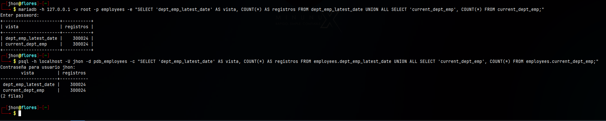

**Figura 5.** Comparación directa del número total de registros de las vistas en MariaDB y PostgreSQL. Ambas vistas presentan 300024 registros en los dos gestores.

---

## 2.18 Verificación de las definiciones adaptadas almacenadas en PostgreSQL

Finalmente se consultó el catálogo `pg_views` para comprobar las definiciones que PostgreSQL almacenó para las vistas migradas.

### Comando ejecutado

```bash
psql -h localhost -U jhon -d pdb_employees -c "SELECT viewname AS vista, definition AS definicion FROM pg_views WHERE schemaname='employees' ORDER BY viewname;"
```

### Resultado

```text
        vista         |                                                         definicion
----------------------+-----------------------------------------------------------------------------------------------------------------------------
 current_dept_emp     |  SELECT l.emp_no,                                                                                                          +
                      |     d.dept_no,                                                                                                             +
                      |     l.from_date,                                                                                                           +
                      |     l.to_date                                                                                                              +
                      |    FROM (dept_emp d                                                                                                        +
                      |      JOIN dept_emp_latest_date l ON (((d.emp_no = l.emp_no) AND (d.from_date = l.from_date) AND (l.to_date = d.to_date))));
 dept_emp_latest_date |  SELECT emp_no,                                                                                                            +
                      |     max(from_date) AS from_date,                                                                                           +
                      |     max(to_date) AS to_date                                                                                                +
                      |    FROM dept_emp                                                                                                           +
                      |   GROUP BY emp_no;
(2 filas)
```

El resultado confirma que PostgreSQL almacenó correctamente las dos definiciones adaptadas:

- `current_dept_emp` conserva el `JOIN` entre `dept_emp` y `dept_emp_latest_date`.
- `dept_emp_latest_date` conserva las funciones `MAX()` y la agrupación mediante `GROUP BY emp_no`.

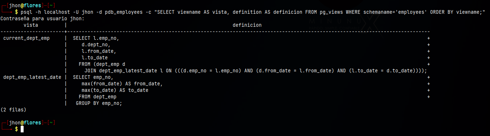

**Figura 6.** Verificación de las definiciones adaptadas de `current_dept_emp` y `dept_emp_latest_date` almacenadas en PostgreSQL.

---

## 2.19 Resultado de la migración de vistas

La migración de vistas desde MariaDB hacia PostgreSQL se completó satisfactoriamente.

Durante el procedimiento se comprobó que:

- MariaDB contiene **2 vistas originales**.
- Se extrajeron las definiciones originales mediante `SHOW CREATE VIEW`.
- Se analizó la dependencia existente entre ambas vistas.
- Se adaptaron los elementos de sintaxis específicos de MariaDB.
- Se creó primero `dept_emp_latest_date` debido a la dependencia existente.
- Posteriormente se creó `current_dept_emp`.
- PostgreSQL contiene las **2 vistas migradas**.
- Las definiciones finales almacenadas fueron verificadas mediante `pg_views`.
- Se realizaron consultas de prueba sobre ambas vistas.
- Las muestras de 10 registros coinciden entre MariaDB y PostgreSQL.
- `dept_emp_latest_date` contiene **300024 registros** tanto en MariaDB como en PostgreSQL.
- `current_dept_emp` contiene **300024 registros** tanto en MariaDB como en PostgreSQL.
- La diferencia en el número de registros es **0** para ambas vistas.

Por lo tanto, las vistas fueron migradas conservando su lógica y produciendo resultados equivalentes en las verificaciones realizadas entre el sistema de origen MariaDB y el sistema de destino PostgreSQL.


# 3. Consultas de Verificación

## 3.1 Objetivo de la verificación

Una vez finalizada la migración de las tablas y vistas desde MariaDB hacia PostgreSQL, se realizó una etapa de verificación con el objetivo de comprobar que los datos migrados mantienen su cantidad, contenido e integridad.

La validación se realizó mediante:

- Conteo de filas de las seis tablas.
- Comparación de conteos entre MariaDB y PostgreSQL.
- Cálculo de checksums MD5 sobre representaciones determinísticas de los registros.
- Verificación de integridad referencial mediante búsqueda de registros huérfanos.
- Comprobación de las restricciones `FOREIGN KEY` existentes en PostgreSQL.

Las tablas verificadas fueron:

- `departments`
- `employees`
- `dept_emp`
- `dept_manager`
- `salaries`
- `titles`

---

## 3.2 Conteo de filas en MariaDB

En primer lugar, se verificó la cantidad de registros existentes en las seis tablas de la base de datos origen `employees` en MariaDB.

### Comando ejecutado

```bash
mariadb -h 127.0.0.1 -u root -p employees -e "SELECT 'departments' AS tabla, COUNT(*) AS registros FROM departments UNION ALL SELECT 'employees', COUNT(*) FROM employees UNION ALL SELECT 'dept_emp', COUNT(*) FROM dept_emp UNION ALL SELECT 'dept_manager', COUNT(*) FROM dept_manager UNION ALL SELECT 'salaries', COUNT(*) FROM salaries UNION ALL SELECT 'titles', COUNT(*) FROM titles;"
```

### Resultado

```text
departments  | 9
employees    | 300024
dept_emp     | 331603
dept_manager | 24
salaries     | 2844047
titles       | 443308
```

El total de registros almacenados en las seis tablas es:

```text
3919015
```

---

## 3.3 Conteo de filas en PostgreSQL

Posteriormente se realizó el mismo conteo sobre las tablas migradas al esquema `employees` de la base de datos `pdb_employees` en PostgreSQL.

### Comando ejecutado

```bash
psql -h localhost -U jhon -d pdb_employees -c "SELECT 'departments' AS tabla, COUNT(*) AS registros FROM employees.departments UNION ALL SELECT 'employees', COUNT(*) FROM employees.employees UNION ALL SELECT 'dept_emp', COUNT(*) FROM employees.dept_emp UNION ALL SELECT 'dept_manager', COUNT(*) FROM employees.dept_manager UNION ALL SELECT 'salaries', COUNT(*) FROM employees.salaries UNION ALL SELECT 'titles', COUNT(*) FROM employees.titles;"
```

### Resultado

```text
departments  | 9
employees    | 300024
dept_emp     | 331603
dept_manager | 24
salaries     | 2844047
titles       | 443308
```

El total de registros almacenados en PostgreSQL es:

```text
3919015
```

---

## 3.4 Comparación de conteos entre MariaDB y PostgreSQL

Los resultados obtenidos en ambos sistemas gestores fueron comparados tabla por tabla.

| Tabla | MariaDB | PostgreSQL | Diferencia |
|---|---:|---:|---:|
| `departments` | 9 | 9 | 0 |
| `employees` | 300024 | 300024 | 0 |
| `dept_emp` | 331603 | 331603 | 0 |
| `dept_manager` | 24 | 24 | 0 |
| `salaries` | 2844047 | 2844047 | 0 |
| `titles` | 443308 | 443308 | 0 |
| **Total** | **3919015** | **3919015** | **0** |

No se encontraron diferencias en la cantidad de registros entre el origen y el destino.

Como evidencia complementaria se presenta la comparación de los conteos ejecutados en ambos gestores.

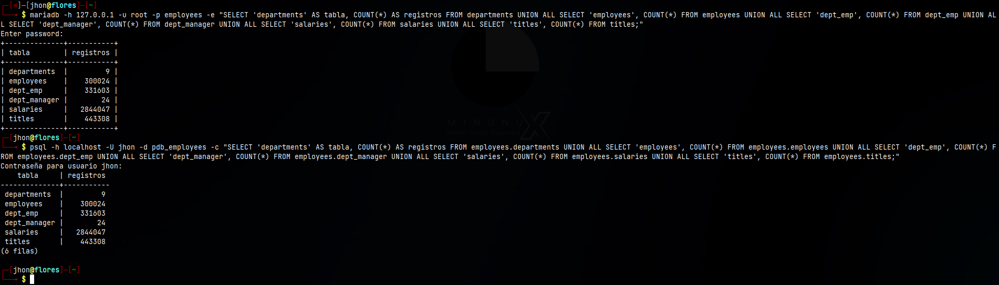

---

## 3.5 Metodología utilizada para los checksums

Además del conteo de filas, se realizaron verificaciones mediante checksums MD5.

El objetivo fue comprobar que los valores de los registros migrados coincidieran entre MariaDB y PostgreSQL, y no únicamente que ambas bases tuvieran la misma cantidad de filas.

Para obtener resultados comparables se construyó una representación determinística de cada registro mediante `CONCAT_WS`, ordenando siempre las filas por sus columnas principales.

En MariaDB se utilizó:

```sql
MD5(GROUP_CONCAT(... ORDER BY ... SEPARATOR '#'))
```

Mientras que en PostgreSQL se utilizó:

```sql
MD5(STRING_AGG(..., '#' ORDER BY ...))
```

Para las tablas grandes se aplicó una estrategia de checksums por bloques. Cada bloque genera su propio MD5 y posteriormente los hashes de todos los bloques se concatenan en orden para obtener un checksum global.

Esto evita procesar toda la tabla como una única cadena y permite aplicar el mismo procedimiento lógico en ambos SGBD.

---

## 3.6 Checksum de la tabla `departments`

Debido al reducido tamaño de la tabla `departments`, el checksum pudo calcularse directamente.

### MariaDB

```sql
SELECT MD5(
    GROUP_CONCAT(
        CONCAT_WS('|', dept_no, dept_name)
        ORDER BY dept_no
        SEPARATOR '#'
    )
) AS checksum_departments
FROM departments;
```

Resultado:

```text
39929f56c0dbcadfc702b03004c7daa3
```

### PostgreSQL

```sql
SELECT MD5(
    STRING_AGG(
        CONCAT_WS('|', dept_no, dept_name),
        '#' ORDER BY dept_no
    )
) AS checksum_departments
FROM employees.departments;
```

Resultado:

```text
39929f56c0dbcadfc702b03004c7daa3
```

Los checksums son idénticos.

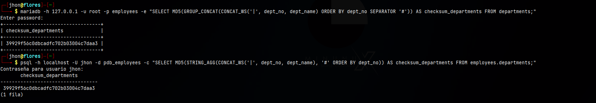

---

## 3.7 Checksum de la tabla `employees`

Para la tabla `employees` se utilizaron bloques definidos mediante `FLOOR(emp_no/10000)`.

### MariaDB

```sql
SELECT
    COUNT(*) AS bloques,
    SUM(filas) AS filas,
    MD5(
        GROUP_CONCAT(checksum ORDER BY bloque SEPARATOR '#')
    ) AS checksum_employees
FROM (
    SELECT
        FLOOR(emp_no/10000) AS bloque,
        COUNT(*) AS filas,
        MD5(
            GROUP_CONCAT(
                CONCAT_WS(
                    '|',
                    emp_no,
                    birth_date,
                    first_name,
                    last_name,
                    gender,
                    hire_date
                )
                ORDER BY emp_no
                SEPARATOR '#'
            )
        ) AS checksum
    FROM employees
    GROUP BY FLOOR(emp_no/10000)
) AS b;
```

Resultado:

```text
bloques | filas  | checksum_employees
31      | 300024 | 2aefe1cf246d5d4fe4c8a4ec30b89e66
```

### PostgreSQL

```sql
WITH b AS (
    SELECT
        FLOOR(emp_no/10000.0)::int AS bloque,
        COUNT(*) AS filas,
        MD5(
            STRING_AGG(
                CONCAT_WS(
                    '|',
                    emp_no,
                    birth_date,
                    first_name,
                    last_name,
                    gender,
                    hire_date
                ),
                '#' ORDER BY emp_no
            )
        ) AS checksum
    FROM employees.employees
    GROUP BY FLOOR(emp_no/10000.0)::int
)
SELECT
    COUNT(*) AS bloques,
    SUM(filas) AS filas,
    MD5(
        STRING_AGG(checksum, '#' ORDER BY bloque)
    ) AS checksum_employees
FROM b;
```

Resultado:

```text
bloques | filas  | checksum_employees
31      | 300024 | 2aefe1cf246d5d4fe4c8a4ec30b89e66
```

Los **300024 registros** y el checksum global coinciden en ambos gestores.

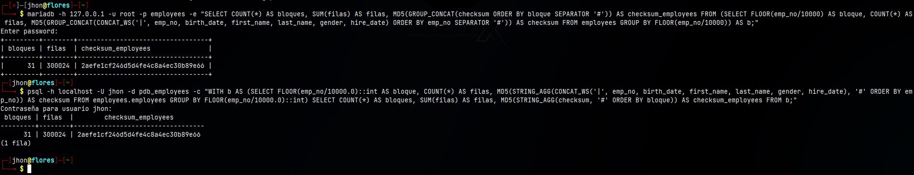

---

## 3.8 Checksum de la tabla `dept_emp`

Para `dept_emp` se utilizó igualmente una división por bloques de empleados.

### MariaDB

```sql
SELECT
    COUNT(*) AS bloques,
    SUM(filas) AS filas,
    MD5(
        GROUP_CONCAT(checksum ORDER BY bloque SEPARATOR '#')
    ) AS checksum_dept_emp
FROM (
    SELECT
        FLOOR(emp_no/10000) AS bloque,
        COUNT(*) AS filas,
        MD5(
            GROUP_CONCAT(
                CONCAT_WS('|', emp_no, dept_no, from_date, to_date)
                ORDER BY emp_no, dept_no, from_date, to_date
                SEPARATOR '#'
            )
        ) AS checksum
    FROM dept_emp
    GROUP BY FLOOR(emp_no/10000)
) AS b;
```

Resultado:

```text
bloques | filas  | checksum_dept_emp
31      | 331603 | f8d63fc8dfa5286bde3a72d87360e034
```

### PostgreSQL

```sql
WITH b AS (
    SELECT
        FLOOR(emp_no/10000.0)::int AS bloque,
        COUNT(*) AS filas,
        MD5(
            STRING_AGG(
                CONCAT_WS('|', emp_no, dept_no, from_date, to_date),
                '#' ORDER BY emp_no, dept_no, from_date, to_date
            )
        ) AS checksum
    FROM employees.dept_emp
    GROUP BY FLOOR(emp_no/10000.0)::int
)
SELECT
    COUNT(*) AS bloques,
    SUM(filas) AS filas,
    MD5(
        STRING_AGG(checksum, '#' ORDER BY bloque)
    ) AS checksum_dept_emp
FROM b;
```

Resultado:

```text
bloques | filas  | checksum_dept_emp
31      | 331603 | f8d63fc8dfa5286bde3a72d87360e034
```

El checksum obtenido coincide exactamente.

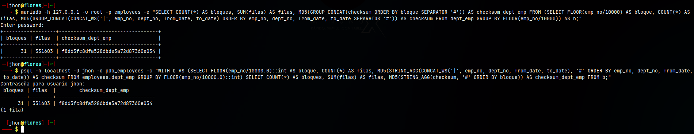

---

## 3.9 Checksum de la tabla `dept_manager`

Debido a que `dept_manager` contiene solamente 24 registros, se calculó directamente un checksum sobre toda la tabla.

### MariaDB

```sql
SELECT
    COUNT(*) AS filas,
    MD5(
        GROUP_CONCAT(
            CONCAT_WS('|', emp_no, dept_no, from_date, to_date)
            ORDER BY emp_no, dept_no, from_date, to_date
            SEPARATOR '#'
        )
    ) AS checksum_dept_manager
FROM dept_manager;
```

Resultado:

```text
filas | checksum_dept_manager
24    | 6816306a04c21dd8b5662943f1d128f2
```

### PostgreSQL

```sql
SELECT
    COUNT(*) AS filas,
    MD5(
        STRING_AGG(
            CONCAT_WS('|', emp_no, dept_no, from_date, to_date),
            '#' ORDER BY emp_no, dept_no, from_date, to_date
        )
    ) AS checksum_dept_manager
FROM employees.dept_manager;
```

Resultado:

```text
filas | checksum_dept_manager
24    | 6816306a04c21dd8b5662943f1d128f2
```

El resultado es idéntico en ambos gestores.

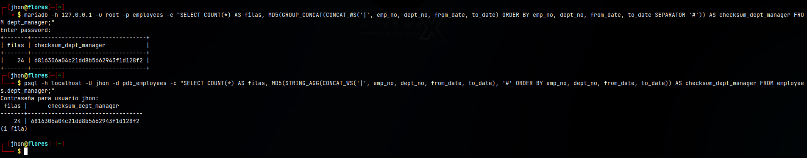

---

## 3.10 Verificación y corrección del checksum de `salaries`

Durante la primera verificación de `salaries` se utilizaron bloques definidos mediante:

```sql
FLOOR(emp_no/10000)
```

Los conteos de registros coincidían entre MariaDB y PostgreSQL, pero los checksums de varios bloques eran diferentes.

Se investigó la causa verificando el tamaño generado por `GROUP_CONCAT` en MariaDB:

```sql
SELECT
    LENGTH(
        GROUP_CONCAT(
            CONCAT_WS('|', emp_no, salary, from_date, to_date)
            ORDER BY emp_no, from_date, to_date, salary
            SEPARATOR '#'
        )
    ) AS longitud_bloque_1,
    @@group_concat_max_len AS limite
FROM salaries
WHERE emp_no BETWEEN 10001 AND 19999;
```

Resultado:

```text
longitud_bloque_1 | limite
1048576           | 1048576
```

Se comprobó que el contenido alcanzaba exactamente el límite configurado de `GROUP_CONCAT`, correspondiente a **1048576 bytes**.

Por lo tanto, la diferencia inicial de checksum no correspondía a una diferencia de datos entre MariaDB y PostgreSQL, sino a una limitación del método de verificación utilizado en MariaDB.

Para evitar la truncación se redujo el tamaño de los bloques utilizando:

```sql
FLOOR(emp_no/1000)
```

### MariaDB con bloques corregidos

```sql
SELECT
    COUNT(*) AS bloques,
    SUM(filas) AS filas,
    MD5(
        GROUP_CONCAT(checksum ORDER BY bloque SEPARATOR '#')
    ) AS checksum_salaries
FROM (
    SELECT
        FLOOR(emp_no/1000) AS bloque,
        COUNT(*) AS filas,
        MD5(
            GROUP_CONCAT(
                CONCAT_WS('|', emp_no, salary, from_date, to_date)
                ORDER BY emp_no, from_date, to_date, salary
                SEPARATOR '#'
            )
        ) AS checksum
    FROM salaries
    GROUP BY FLOOR(emp_no/1000)
) AS b;
```

Resultado final:

```text
bloques | filas   | checksum_salaries
302     | 2844047 | 4b928ad532b679bea550f41614a04ab2
```

### PostgreSQL

```sql
WITH b AS (
    SELECT
        FLOOR(emp_no/1000.0)::int AS bloque,
        COUNT(*) AS filas,
        MD5(
            STRING_AGG(
                CONCAT_WS('|', emp_no, salary, from_date, to_date),
                '#' ORDER BY emp_no, from_date, to_date, salary
            )
        ) AS checksum
    FROM employees.salaries
    GROUP BY FLOOR(emp_no/1000.0)::int
)
SELECT
    COUNT(*) AS bloques,
    SUM(filas) AS filas,
    MD5(
        STRING_AGG(checksum, '#' ORDER BY bloque)
    ) AS checksum_salaries
FROM b;
```

Resultado:

```text
bloques | filas   | checksum_salaries
302     | 2844047 | 4b928ad532b679bea550f41614a04ab2
```

Después de corregir el tamaño de los bloques, los **2844047 registros** y el checksum coinciden exactamente en ambos gestores.

Este problema fue producido por el límite de `GROUP_CONCAT` utilizado durante la verificación y no por una pérdida o modificación de datos durante la migración.

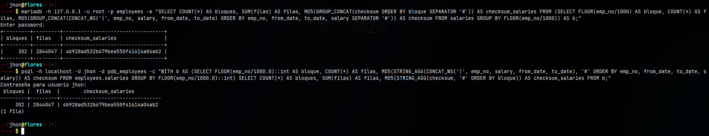

---

## 3.11 Checksum de la tabla `titles`

Para `titles` también se utilizaron bloques definidos mediante `FLOOR(emp_no/1000)`.

### MariaDB

```sql
SELECT
    COUNT(*) AS bloques,
    SUM(filas) AS filas,
    MD5(
        GROUP_CONCAT(checksum ORDER BY bloque SEPARATOR '#')
    ) AS checksum_titles
FROM (
    SELECT
        FLOOR(emp_no/1000) AS bloque,
        COUNT(*) AS filas,
        MD5(
            GROUP_CONCAT(
                CONCAT_WS('|', emp_no, title, from_date, to_date)
                ORDER BY emp_no, title, from_date, to_date
                SEPARATOR '#'
            )
        ) AS checksum
    FROM titles
    GROUP BY FLOOR(emp_no/1000)
) AS b;
```

Resultado:

```text
bloques | filas  | checksum_titles
302     | 443308 | 7cb3ffa9923423aeb62570ee540657b2
```

### PostgreSQL

```sql
WITH b AS (
    SELECT
        FLOOR(emp_no/1000.0)::int AS bloque,
        COUNT(*) AS filas,
        MD5(
            STRING_AGG(
                CONCAT_WS('|', emp_no, title, from_date, to_date),
                '#' ORDER BY emp_no, title, from_date, to_date
            )
        ) AS checksum
    FROM employees.titles
    GROUP BY FLOOR(emp_no/1000.0)::int
)
SELECT
    COUNT(*) AS bloques,
    SUM(filas) AS filas,
    MD5(
        STRING_AGG(checksum, '#' ORDER BY bloque)
    ) AS checksum_titles
FROM b;
```

Resultado:

```text
bloques | filas  | checksum_titles
302     | 443308 | 7cb3ffa9923423aeb62570ee540657b2
```

Los resultados coinciden.

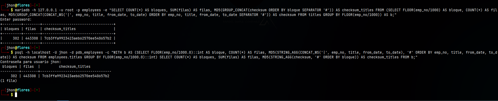

---

## 3.12 Comparación general de checksums

Los resultados finales obtenidos fueron:

| Tabla | Filas | Checksum MariaDB | Checksum PostgreSQL | Resultado |
|---|---:|---|---|---|
| `departments` | 9 | `39929f56c0dbcadfc702b03004c7daa3` | `39929f56c0dbcadfc702b03004c7daa3` | Coincide |
| `employees` | 300024 | `2aefe1cf246d5d4fe4c8a4ec30b89e66` | `2aefe1cf246d5d4fe4c8a4ec30b89e66` | Coincide |
| `dept_emp` | 331603 | `f8d63fc8dfa5286bde3a72d87360e034` | `f8d63fc8dfa5286bde3a72d87360e034` | Coincide |
| `dept_manager` | 24 | `6816306a04c21dd8b5662943f1d128f2` | `6816306a04c21dd8b5662943f1d128f2` | Coincide |
| `salaries` | 2844047 | `4b928ad532b679bea550f41614a04ab2` | `4b928ad532b679bea550f41614a04ab2` | Coincide |
| `titles` | 443308 | `7cb3ffa9923423aeb62570ee540657b2` | `7cb3ffa9923423aeb62570ee540657b2` | Coincide |

Los checksums finales de las seis tablas son iguales entre MariaDB y PostgreSQL.

---

## 3.13 Verificación de registros huérfanos en MariaDB

Para comprobar la integridad referencial del origen se realizaron consultas con `LEFT JOIN` sobre las seis relaciones existentes.

### Consulta ejecutada

```sql
SELECT
    'dept_emp.emp_no -> employees.emp_no' AS relacion,
    COUNT(*) AS huerfanos
FROM dept_emp d
LEFT JOIN employees e ON d.emp_no=e.emp_no
WHERE e.emp_no IS NULL

UNION ALL

SELECT
    'dept_emp.dept_no -> departments.dept_no',
    COUNT(*)
FROM dept_emp d
LEFT JOIN departments p ON d.dept_no=p.dept_no
WHERE p.dept_no IS NULL

UNION ALL

SELECT
    'dept_manager.emp_no -> employees.emp_no',
    COUNT(*)
FROM dept_manager d
LEFT JOIN employees e ON d.emp_no=e.emp_no
WHERE e.emp_no IS NULL

UNION ALL

SELECT
    'dept_manager.dept_no -> departments.dept_no',
    COUNT(*)
FROM dept_manager d
LEFT JOIN departments p ON d.dept_no=p.dept_no
WHERE p.dept_no IS NULL

UNION ALL

SELECT
    'salaries.emp_no -> employees.emp_no',
    COUNT(*)
FROM salaries s
LEFT JOIN employees e ON s.emp_no=e.emp_no
WHERE e.emp_no IS NULL

UNION ALL

SELECT
    'titles.emp_no -> employees.emp_no',
    COUNT(*)
FROM titles t
LEFT JOIN employees e ON t.emp_no=e.emp_no
WHERE e.emp_no IS NULL;
```

### Resultado

```text
relacion                                      | huerfanos
----------------------------------------------+----------
dept_emp.emp_no -> employees.emp_no           | 0
dept_emp.dept_no -> departments.dept_no       | 0
dept_manager.emp_no -> employees.emp_no       | 0
dept_manager.dept_no -> departments.dept_no   | 0
salaries.emp_no -> employees.emp_no           | 0
titles.emp_no -> employees.emp_no             | 0
```

No se encontraron registros huérfanos en MariaDB.

---

## 3.14 Verificación de registros huérfanos en PostgreSQL

Se realizó la misma comprobación sobre las tablas migradas a PostgreSQL.

Durante el primer intento PostgreSQL presentó una limitación de memoria compartida al ejecutar la consulta con paralelismo. Para completar la verificación se desactivó temporalmente el paralelismo de la sesión mediante:

```sql
SET max_parallel_workers_per_gather = 0;
```

Este ajuste se aplicó únicamente a la sesión utilizada para la consulta de verificación y no modifica los datos ni la estructura de la base de datos.

### Consulta ejecutada

```sql
SET max_parallel_workers_per_gather = 0;

SELECT
    'dept_emp.emp_no -> employees.emp_no' AS relacion,
    COUNT(*) AS huerfanos
FROM employees.dept_emp d
LEFT JOIN employees.employees e ON d.emp_no=e.emp_no
WHERE e.emp_no IS NULL

UNION ALL

SELECT
    'dept_emp.dept_no -> departments.dept_no',
    COUNT(*)
FROM employees.dept_emp d
LEFT JOIN employees.departments p ON d.dept_no=p.dept_no
WHERE p.dept_no IS NULL

UNION ALL

SELECT
    'dept_manager.emp_no -> employees.emp_no',
    COUNT(*)
FROM employees.dept_manager d
LEFT JOIN employees.employees e ON d.emp_no=e.emp_no
WHERE e.emp_no IS NULL

UNION ALL

SELECT
    'dept_manager.dept_no -> departments.dept_no',
    COUNT(*)
FROM employees.dept_manager d
LEFT JOIN employees.departments p ON d.dept_no=p.dept_no
WHERE p.dept_no IS NULL

UNION ALL

SELECT
    'salaries.emp_no -> employees.emp_no',
    COUNT(*)
FROM employees.salaries s
LEFT JOIN employees.employees e ON s.emp_no=e.emp_no
WHERE e.emp_no IS NULL

UNION ALL

SELECT
    'titles.emp_no -> employees.emp_no',
    COUNT(*)
FROM employees.titles t
LEFT JOIN employees.employees e ON t.emp_no=e.emp_no
WHERE e.emp_no IS NULL;
```

### Resultado

```text
relacion                                      | huerfanos
----------------------------------------------+----------
dept_emp.emp_no -> employees.emp_no           | 0
dept_emp.dept_no -> departments.dept_no       | 0
dept_manager.emp_no -> employees.emp_no       | 0
dept_manager.dept_no -> departments.dept_no   | 0
salaries.emp_no -> employees.emp_no           | 0
titles.emp_no -> employees.emp_no             | 0
```

Las seis relaciones presentan `0` registros huérfanos.

La comparación directa entre MariaDB y PostgreSQL se muestra en la siguiente evidencia:

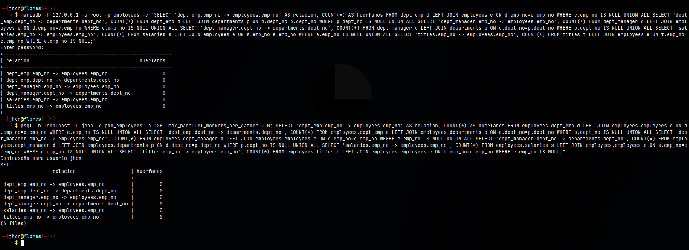

---

## 3.15 Verificación de claves foráneas en PostgreSQL

Además de comprobar la ausencia de registros huérfanos, se verificó que las restricciones `FOREIGN KEY` estuvieran realmente definidas en PostgreSQL.

### Consulta utilizada

```sql
SELECT
    tc.table_name AS tabla,
    tc.constraint_name AS restriccion,
    kcu.column_name AS columna,
    ccu.table_name AS tabla_referenciada,
    ccu.column_name AS columna_referenciada
FROM information_schema.table_constraints tc
JOIN information_schema.key_column_usage kcu
    ON tc.constraint_name=kcu.constraint_name
    AND tc.constraint_schema=kcu.constraint_schema
JOIN information_schema.constraint_column_usage ccu
    ON tc.constraint_name=ccu.constraint_name
    AND tc.constraint_schema=ccu.constraint_schema
WHERE tc.constraint_type='FOREIGN KEY'
  AND tc.table_schema='employees'
ORDER BY tc.table_name, tc.constraint_name;
```

### Resultado

```text
tabla        | restriccion         | columna | tabla_referenciada | columna_referenciada
-------------+---------------------+---------+--------------------+---------------------
dept_emp     | dept_emp_ibfk_1     | emp_no  | employees          | emp_no
dept_emp     | dept_emp_ibfk_2     | dept_no | departments        | dept_no
dept_manager | dept_manager_ibfk_1 | emp_no  | employees          | emp_no
dept_manager | dept_manager_ibfk_2 | dept_no | departments        | dept_no
salaries     | salaries_ibfk_1     | emp_no  | employees          | emp_no
titles       | titles_ibfk_1       | emp_no  | employees          | emp_no
```

Se verificaron:

```text
6 filas
```

Se confirmó que PostgreSQL conserva las seis relaciones mediante claves foráneas.

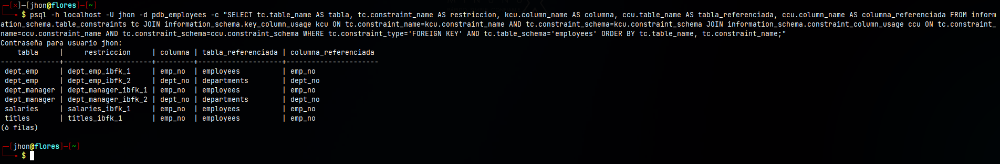

---

## 3.16 Análisis comparativo de los resultados

Las verificaciones realizadas permiten comparar el resultado final de la migración entre MariaDB y PostgreSQL.

### Conteo de registros

Las seis tablas presentan exactamente la misma cantidad de registros en ambos gestores.

El total es de:

```text
3919015 registros
```

La diferencia total entre origen y destino es:

```text
0 registros
```

Por lo tanto, no se detectaron pérdidas ni duplicaciones de registros mediante la comparación de conteos.

### Checksums

Los checksums MD5 finales de las seis tablas coinciden entre MariaDB y PostgreSQL.

Esto proporciona una verificación adicional al conteo de filas, ya que se comparó una representación ordenada de los valores almacenados en los registros.

Los seis resultados fueron:

```text
departments  -> 39929f56c0dbcadfc702b03004c7daa3
employees    -> 2aefe1cf246d5d4fe4c8a4ec30b89e66
dept_emp     -> f8d63fc8dfa5286bde3a72d87360e034
dept_manager -> 6816306a04c21dd8b5662943f1d128f2
salaries     -> 4b928ad532b679bea550f41614a04ab2
titles       -> 7cb3ffa9923423aeb62570ee540657b2
```

Todos los checksums finales coinciden entre ambos SGBD.

### Integridad referencial

Las seis relaciones verificadas presentan:

```text
0 registros huérfanos
```

tanto en MariaDB como en PostgreSQL.

Además, se comprobó directamente mediante `information_schema` que las seis restricciones `FOREIGN KEY` se encuentran definidas en PostgreSQL.

### Problemas encontrados durante la verificación

Durante el cálculo inicial del checksum de `salaries` se obtuvo una diferencia entre ambos gestores.

La investigación mostró que MariaDB estaba alcanzando el límite:

```text
group_concat_max_len = 1048576
```

por lo que la cadena utilizada para generar el checksum era truncada en los bloques de mayor tamaño.

El problema se resolvió reduciendo los bloques desde:

```text
FLOOR(emp_no/10000)
```

a:

```text
FLOOR(emp_no/1000)
```

Después de aplicar la corrección, MariaDB y PostgreSQL produjeron exactamente el mismo checksum:

```text
4b928ad532b679bea550f41614a04ab2
```

Por lo tanto, la diferencia inicial correspondía al procedimiento de verificación y no a los datos migrados.

Durante la consulta de integridad referencial en PostgreSQL también se presentó una limitación de memoria compartida al intentar ejecutar la consulta con paralelismo.

Para completar la verificación se utilizó temporalmente:

```sql
SET max_parallel_workers_per_gather = 0;
```

Después de aplicar este ajuste a la sesión, la consulta pudo ejecutarse correctamente y confirmó `0` registros huérfanos en todas las relaciones.

Por lo tanto, los problemas encontrados durante esta etapa correspondieron a aspectos técnicos del procedimiento de verificación y no evidenciaron diferencias en los datos migrados.

---

## 3.17 Resultado final de la verificación

La verificación final permitió comprobar que la migración conserva correctamente los datos del sistema `employees`.

Los resultados obtenidos fueron:

- Las seis tablas presentan el mismo número de registros.
- Se verificaron un total de **3919015 registros** en ambos gestores.
- La diferencia de registros entre MariaDB y PostgreSQL es **0**.
- Los checksums finales de las seis tablas coinciden.
- Las seis relaciones verificadas presentan **0 registros huérfanos** tanto en MariaDB como en PostgreSQL.
- PostgreSQL conserva las **6 restricciones `FOREIGN KEY`**.
- El problema inicial del checksum de `salaries` fue identificado como una limitación de `GROUP_CONCAT` y fue corregido reduciendo el tamaño de los bloques.
- La limitación de memoria compartida encontrada durante la consulta de huérfanos en PostgreSQL fue resuelta desactivando temporalmente el paralelismo de la sesión.
- Las diferencias encontradas durante el proceso correspondieron al procedimiento de verificación y no a los datos migrados.

Por lo tanto, las pruebas realizadas confirman que los datos migrados desde MariaDB hacia PostgreSQL mantienen su cantidad, contenido e integridad referencial.


---

# 4. Respaldo final de PostgreSQL

Como parte de los entregables finales del proyecto, se generó un respaldo de la base de datos PostgreSQL `pdb_employees` utilizando `pg_dump` en formato personalizado.

## 4.1 Generación del respaldo

```bash
mkdir -p ~/ProyectoFinal_JhonFlores/backup && pg_dump -h localhost -U jhon -d pdb_employees -Fc -f ~/ProyectoFinal_JhonFlores/backup/pdb_employees.dump
```

El archivo generado fue:

```text
/home/jhon/ProyectoFinal_JhonFlores/backup/pdb_employees.dump
```

Tamaño obtenido:

```text
34 MB
```

## 4.2 Verificación del respaldo

Para comprobar que el archivo generado podía ser interpretado correctamente por PostgreSQL se utilizó:

```bash
pg_restore -l ~/ProyectoFinal_JhonFlores/backup/pdb_employees.dump | tail -20
```

La salida mostró elementos correspondientes a los datos de las tablas, restricciones, índices y claves foráneas, sin presentar errores.

Como evidencia complementaria se presenta la generación y verificación del respaldo:

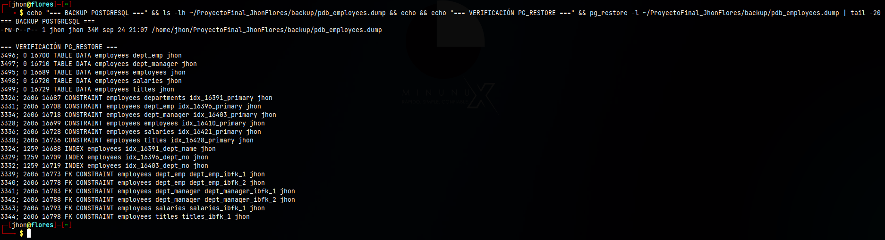

El archivo `pdb_employees.dump` queda incluido como parte de los entregables finales del proyecto.


---

# Referencias

- PostgreSQL Global Development Group. **PostgreSQL Documentation**. Documentación oficial de PostgreSQL utilizada como referencia para la creación, administración, consultas, restricciones y respaldo de la base de datos.

- MariaDB Foundation. **MariaDB Documentation**. Documentación oficial utilizada como referencia para consultas, estructura de tablas, vistas y funciones empleadas durante la verificación de la base de datos origen.

- Dimitri Fontaine. **pgloader Documentation**. Documentación de la herramienta utilizada para realizar la migración de datos desde MariaDB hacia PostgreSQL.

- pgModeler Project. **PostgreSQL Database Modeler (pgModeler) Documentation**. Documentación de la herramienta utilizada para el modelado y exportación de la estructura de la base de datos.

- Docker, Inc. **Docker Documentation**. Documentación oficial utilizada como referencia para la ejecución y administración de los servicios MariaDB, PostgreSQL, pgAdmin y Adminer mediante contenedores.

- PostgreSQL Global Development Group. **pg_dump Documentation**. Referencia utilizada para la generación del respaldo de la base de datos `pdb_employees`.

- PostgreSQL Global Development Group. **pg_restore Documentation**. Referencia utilizada para verificar el contenido y la estructura del respaldo generado.